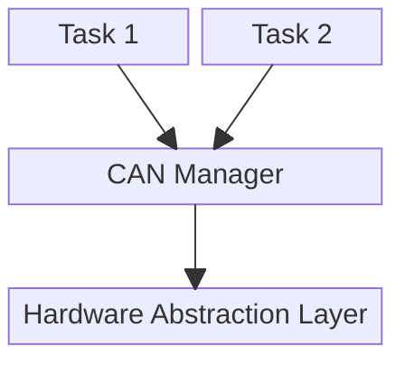

# Bismuth-Project

**Bismuth-Project** is an embedded systems portfolio project demonstrating real-time communication between an STM32 microcontroller and a Raspberry Pi Pico over the CAN bus.

The STM32 acts as the main controller, running **FreeRTOS** to manage multiple tasks for communication and data handling. The Raspberry Pi Pico functions as a peripheral, reading sensor data and transmitting it via CAN.

## 🛠️ Technologies

- STM32
- Raspberry Pi Pico
- CAN Bus Communication
- FreeRTOS
- Arduino
- C / C++

## 🚀 Goals

- Implement multi-tasking with FreeRTOS on STM32
- Communicate via CAN between STM32 and Pico
- Read and transmit real sensor data
- Serve as a clean, modular, and well-documented portfolio project

## 📟 Required Hardware 
* STM32F4DISCOVERY
* Raspberry Pi Pico YD-RP2040
* CAN transceiver: TJ1050 and MCP2515
* Ultrasonic Sensor HC SR04

## 📐 System Architecture
### STM Implementation
This diagram illustrates the architecture of the STM32 FreeRTOS-based application in the Bismuth-Project, specifically how tasks interact with the CAN bus:

* Task 1 and Task 2 represent FreeRTOS tasks responsible for different system functionalities—e.g., processing sensor data, monitoring communication, or triggering events.

* Both tasks interface with a CAN Manager module, which centralizes CAN communication. This abstraction ensures that message sending, receiving, filtering, and buffering are handled in a consistent and synchronized way.

* The CAN Manager interacts with the Hardware Abstraction Layer (HAL) to perform low-level communication with the CAN peripheral on the STM32.

In this demonstration, Task 1 is responsible for requesting a specific frame from the Pico, interpreting the ultrasonic sensor data and turning on an LED based on the measured distance.

Task 2 is responsible for receiving a specific frame when the USR button on the Pico board is pressed and toggling the blue LED on the ST's board.

### Pico Implementation